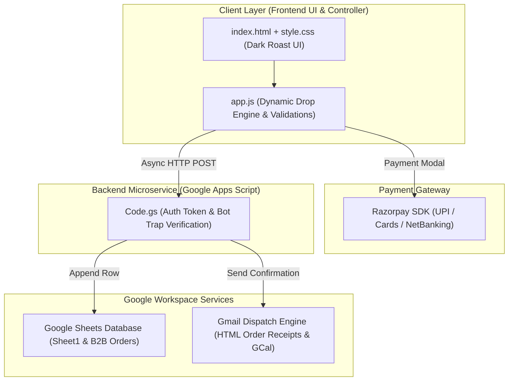

# ☕ The Apartment Brew Co. — Web Portal & Order Intake System

> **Micro-Batch Flash-Chilled Specialty Coffee • Gurugram & Delhi NCR**  
> A lightweight, serverless e-commerce and order intake portal designed for scheduled micro-batch coffee drops, direct payment gateway integration, live order tracking, and automated customer notifications.

---

## 📌 1. Overview & Business Model

**The Apartment Brew Co.** operates an asset-light, pre-order only micro-batch coffee model:
* **Extraction & Freshness**: Coffee is extracted hot to capture volatile aromatics and flash-chilled immediately over ice. Zero preservatives with a strict **48-hour peak freshness window**.
* **Dual Delivery Pathways**:
  * **B2C (Individual Saturday Morning Drops)**: Pre-orders close Friday 10:00 PM; delivered Saturday 8:00 AM – 11:00 AM.
  * **B2B (Corporate Friday Office Drops)**: Orders close Thursday 6:00 PM; delivered Friday (Morning Kickoff or Afternoon Recharge).
* **Coverage**: Hyper-local Delhi NCR (Gurugram DLF Phases 1-5, Cyber City, Golf Course Rd, Candor TechSpace, Udyog Vihar, Noida, South Delhi).

---

## 🏗️ 2. System Architecture



### Architecture Data Flow

```text
+-------------------------------------------------------------------------+
|                              CLIENT LAYER                               |
|        index.html (Semantic UI)  +  style.css (Dark Roast Palette)      |
|        app.js (Dynamic Cutoff Engine, Validation & LocalStorage)        |
+--------------------+--------------------------------+-------------------+
                     |                                |
         Razorpay SDK Callback             Async HTTP POST (JSON)
                     |                                |
                     v                                v
+----------------------------+   +----------------------------------------+
|    Razorpay Gateway SDK    |   |     Google Apps Script (Code.gs)       |
|    (UPI / Cards / NetBank) |   |     - Shared Auth Token Security Check |
+----------------------------+   |     - Anti-Bot Honeypot Trap Filter    |
                                 +--------------------+-------------------+
                                                      |
                                     +----------------+---------------+
                                     |                                |
                                     v                                v
       +---------------------------------------------+  +--------------------------------+
       |           Google Sheets Database            |  |    Gmail Notification Engine   |
       |  - Tab 1: Sheet1 (B2C Orders, 17 Columns)   |  |  - B2C Saturday Drop Receipt   |
       |  - Tab 2: B2B Orders (Corporate, 22 Columns)|  |  - B2B Friday Corporate Drop  |
       +---------------------------------------------+  +--------------------------------+
```

---

## 📂 3. Repository File Structure

* `index.html` - Main single-page application structure & DOM hierarchy
* `style.css` - Modular stylesheet with CSS custom properties & animations
* `app.js` - Frontend logic, validation, countdowns, and payment flow
* `Code.gs` - Google Apps Script backend controller & email dispatcher
* `README.md` - Repository documentation and architecture overview

---

## 🚀 4. Detailed Component Breakdown

### 1. `index.html` (Frontend Structure)
* **Branding Header**: Brand titles, active drop announcement (`#dropBanner`), live cutoff countdown (`#countdownTimer`), and limited batch scarcity progress bar (`#scarcityText`, `#scarcityFill`).
* **Segmented Mode Switch**: Smooth toggle between B2C (`#tabB2c`) and B2B (`#tabB2b`).
* **Interactive Lot Selector**: Single-estate visual cards with tasting notes, roast levels, and acidity/body sensory meters (`#lotGrid`).
* **Pack Selection Grids**:
  * B2C: Single Bottle (₹240), Duo Pack (₹480), Weekend Pack (₹899), Mega Weekend (6x 250ml, ₹1,200).
  * B2B: Team Pack (₹1,800), Office Batch (₹3,400), Floor Pack (₹6,000), Townhall Bulk (₹8,700).
* **Customer & Delivery Details**:
  * Returning customer 1-click autofill banner (`#savedProfileBar`).
  * PIN Code validator with live Delhi NCR serviceability feedback (`#pinStatus`).
  * Drop & gate instruction selector (Door drop vs Security / Concierge desk vs Call upon arrival).
* **Interactive Freshness Accordion**: 48-Hour storage and serving guide (`.guide-accordion`).
* **Confirmation View**: Order receipt, Google Calendar 1-click reminder button (`.btn-calendar`), and formatted WhatsApp receipt trigger (`.btn-whatsapp`).

### 2. `style.css` (Design System)
* **Color Palette**: Dark roast aesthetic (`--bg: #141312`, `--card-bg: #1f1d1a`, `--card-inner: #151413`) with coffee gold accents (`--accent: #d4a373`) and status indicators (`--whatsapp: #25d366`, `--success: #2d6a4f`, `--info-blue: #90e0ef`).
* **Responsive Layout**: Mobile-first flex container capped at 520px width.
* **Component Styling**: Styled lot cards, sensory meter fill bars, scarcity tracks, and accessible form inputs.

### 3. `app.js` (Frontend Controller)
* **Configuration**: Manages Razorpay Key ID, Google Apps Script endpoint URL, and shared authentication token.
* **Dynamic Cutoff Engine**:
  * Calculates closest Saturday morning delivery for B2C.
  * Calculates closest Friday delivery for B2B.
  * Computes live ticking countdown to Thursday 6:00 PM (B2B) and Friday 10:00 PM (B2C) cutoffs.
* **1-Click Profile Caching**: Saves customer details in browser `localStorage` (`tabc_customer_profile`) for instant re-ordering.
* **Validation Subsystem**:
  * Delhi NCR PIN Code RegEx: `^(11[0-9]{4}|122[0-9]{3}|121[0-9]{3}|201[0-9]{3})$` (Delhi, Gurugram, Faridabad, Noida/Ghaziabad).
  * Indian Mobile Number RegEx: `^[6-9]\d{9}$`.
  * 15-character GSTIN RegEx: `^[0-9]{2}[A-Z]{5}[0-9]{4}[A-Z]{1}[1-9A-Z]{1}Z[0-9A-Z]{1}$`.
* **Checkout & Dispatch**: Opens Razorpay checkout modal or generates corporate invoice IDs (`INV-REQ-xxxxxx`), then dispatches payload to Apps Script via `fetch(..., { mode: 'no-cors' })`.
* **Google Calendar Link Generator**: Generates formatted Google Calendar URL with delivery window, order ID, and refrigeration reminders.
* **WhatsApp Sync**: Formats structured WhatsApp pre-filled text receipts.

### 4. `Code.gs` (Backend Microservice)
* **Security Checks**: Verifies `authToken === 'TABC_SECURE_TOKEN_2026'` and rejects bots using honeypot detection (`botTrap`).
* **Database Routing**:
  * B2C orders append to `Sheet1` (17 columns, instruction in Column G).
  * B2B orders append to `B2B Orders` (22 columns, instruction in Column K).
* **Email Generator**: Dispatches inline-styled HTML confirmation emails via `GmailApp.sendEmail` with order details, 48-hour shelf-life guidelines, and Google Calendar event links.

---

## 📊 5. Google Sheets Database Schema

### `Sheet1` (B2C Orders — 17 Columns)
`Order Timestamp` | `Order ID` | `Customer Name` | `WhatsApp Number` | `Email Address` | `Delivery Address / Area` | `Delivery / Gate Instruction` | `Delivery Date` | `Coffee Bean Lot` | `Pack Selected` | `Quantity` | `Total Bottles` | `Total Amount (₹)` | `Payment Preference` | `Payment Status` | `Delivery Status` | `Notes / UTR`

### `B2B Orders` (Corporate Drops — 22 Columns)
`Order Timestamp` | `Order ID` | `Company / Business Name` | `Contact Person Name` | `Work Email` | `WhatsApp / Phone` | `GSTIN` | `Tech Park / Commercial Complex` | `Building / Tower / Floor` | `PIN Code` | `Delivery / Gate Instruction` | `Delivery Window` | `Delivery Date (Friday Drop)` | `Coffee Lot Selection` | `Pack Tier` | `Quantity` | `Total Bottles` | `Total Amount (₹)` | `Payment Method` | `Payment Status` | `Delivery Status` | `Notes / Payment Ref / PO Number`

---

## ⚙️ 6. Deployment & Configuration Guide

1. **Deploy Google Apps Script**:
   * Open your Google Sheet (`The Apartment Brew Co. — Live Order Tracker`).
   * Navigate to **Extensions > Apps Script** and paste `Code.gs`.
   * Click **Deploy > New Deployment**, select **Web App**, set *Execute as* to **Me**, and *Who has access* to **Anyone**.
   * Copy the generated Web App URL (`https://script.google.com/macros/s/.../exec`).

2. **Configure Frontend**:
   * In `app.js`, set `CONFIG.googleSheetEndpoint` to your deployed Apps Script Web App URL.
   * Set `CONFIG.razorpayKeyId` to your active Razorpay Key (`rzp_live_...` or `rzp_test_...`).
   * Set `CONFIG.authToken` to match `AUTH_TOKEN` in `Code.gs`.

3. **Deploy Web Application**:
   * Host `index.html`, `style.css`, and `app.js` on GitHub Pages, Cloudflare Pages, Vercel, or Netlify.
