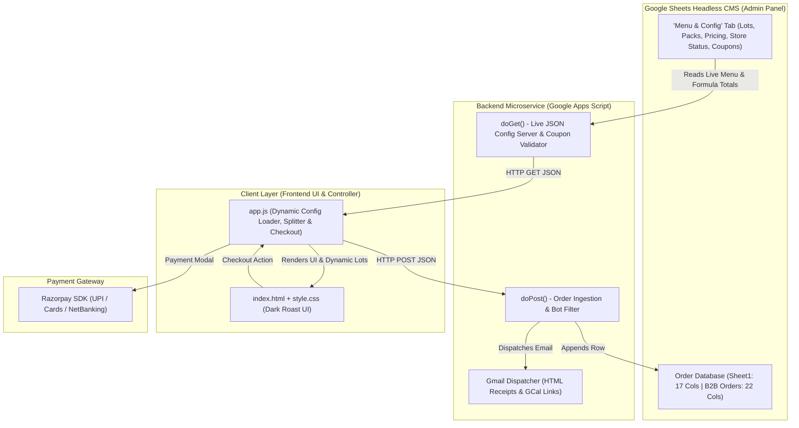

# ☕ The Apartment Brew Co. — Web Portal & Order Intake System

> **Micro-Batch Flash-Chilled Specialty Coffee • Gurugram & Delhi NCR**  
> A lightweight, serverless e-commerce and order intake portal powered by a **Google Sheets Headless CMS**, featuring live menu rotations, dynamic pricing, automated batch scarcity tracking, payment gateway integration, and instant transactional email confirmations.

---

## 📌 1. Overview & Business Model

**The Apartment Brew Co.** operates an asset-light, pre-order only micro-batch coffee venture:
* **Extraction & Freshness**: Coffee is extracted hot to capture volatile aromatics and flash-chilled immediately over ice. Zero preservatives with a strict **48-hour peak freshness window**.
* **Dual Delivery Pathways**:
  * **B2C (Individual Saturday Morning Drops)**: Pre-orders close Friday 10:00 PM; delivered Saturday 8:00 AM – 11:00 AM.
  * **B2B (Corporate Friday Office Drops)**: Orders close Thursday 6:00 PM; delivered Friday (Morning Kickoff or Afternoon Recharge).
* **Coverage**: Hyper-local Delhi NCR (Gurugram DLF Phases 1-5, Cyber City, Golf Course Rd, Candor TechSpace, Udyog Vihar, Noida, South Delhi).

---

## 🏗️ 2. System Architecture



### Architecture Data Flow

```text
+-------------------------------------------------------------------------+
|                  GOOGLE SHEETS HEADLESS CMS & DATABASE                  |
|  - Tab 1: 'Menu & Config' (Lots, Packs, Pricing, Store Status, Coupons) |
|  - Tab 2: 'Sheet1' (B2C Orders — 17 Columns)                           |
|  - Tab 3: 'B2B Orders' (Corporate Drops — 22 Columns)                  |
+--------------------+--------------------------------+-------------------+
                     ^                                |
       doPost() Order Log               doGet() Live Config Feed
                     |                                v
+------------------------------------+   +--------------------------------+
|    Google Apps Script (Code.gs)    |   |     Client Layer (Frontend)    |
|    - doGet: Config & Coupon Server |   |  - index.html (Semantic UI)    |
|    - doPost: Order & Email Engine  |   |  - style.css (Dark Roast UI)   |
|    - Auth Token & Bot Trap Filter  |   |  - app.js (Dynamic Controller) |
+--------------------+---------------+   +----------------+---------------+
                     |                                    |
                     v                                    v
       +----------------------------+       +-----------------------------+
       | Gmail Notification Engine  |       |    Razorpay Payment SDK     |
       | - Safe HTML Confirmations  |       |   (UPI, Cards, NetBanking)  |
       | - 1-Click GCal Invitations |       +-----------------------------+
       +----------------------------+
```

---

## 📂 3. Repository File Structure

* `index.html` - Semantic single-page structure, dynamic lot/pack grids, coupon field, and receipt view.
* `style.css` - Dark-roast design tokens, sensory meters, custom ratio splitters, coupon badges, and responsive layouts.
* `app.js` - Dynamic configuration fetcher, offline fallback cache, custom split balancing, live cutoff countdown, and validation.
* `Code.gs` - Google Apps Script backend controller, `doGet` config server, `doPost` order ingestion, and email dispatcher.
* `README.md` - Complete architectural guide, database schemas, and operator SOPs.

---

## 🚀 4. Detailed Component Breakdown

### 1. `index.html` (Frontend Structure)
* **Branding Header**: Brand logo, active drop banner (`#dropBanner`), live countdown timer (`#countdownTimer`), and capacity scarcity bar (`#scarcityText`, `#scarcityFill`).
* **Store Status Alert**: Top banner (`#storeStatusBanner`) that dynamically displays alerts if drops are paused or sold out.
* **Mode Switcher**: Toggle between B2C (`#tabB2c`) and B2B (`#tabB2b`).
* **Dynamic Lot Selector (`#lotGrid`)**: Populated dynamically from Google Sheets with tasting notes, roast levels, and acidity/body sensory meters.
* **Build Your Own Batch (Custom Ratio Splitter)**: Dynamic bottle steppers (`+` / `–`) allowing customers to customize exact lot ratios between Ratnagiri Anaerobic and Thogarihunkal Washed with an interactive dual-tone ratio bar.
* **Dynamic Pack Grids (`#b2cPacks`, `#b2bPacks`)**: Renders pack tiers and prices live from Google Sheets.
* **Promo & Coupon Input**: `#couponInput` and `#btn-coupon` for instant discount validation.
* **Customer & Delivery Fields**: Autocomplete returning customer banner (`#savedProfileBar`), Delhi NCR PIN code validator, and 3-option gate delivery preference selector.
* **Freshness Accordion**: 48-Hour storage and serving guide (`.guide-accordion`).
* **Confirmation View**: Order receipt, Google Calendar 1-click reminder (`.btn-calendar`), and formatted WhatsApp receipt (`.btn-whatsapp`).

### 2. `style.css` (Design System)
* **Color Palette**: Dark roast aesthetic (`--bg: #141312`, `--card-bg: #1f1d1a`, `--card-inner: #151413`) with coffee gold accents (`--accent: #d4a373`) and status indicators (`--whatsapp: #25d366`, `--success: #2d6a4f`, `--info-blue: #90e0ef`).
* **Components**: Custom ratio splitter steppers, dual-tone ratio tracks, coupon input groups, error tooltips, and confirmation receipt cards.
* **Responsive Layout**: Mobile-first flex container capped at 520px width.

### 3. `app.js` (Frontend Controller)
* **Dynamic Config Fetcher (`fetchLiveConfig`)**: Loads menu lots, packs, scarcity counts, and store status from Google Sheets on page load with built-in instant fallback if offline.
* **Dynamic Cutoff Engine**: Computes ticking countdown to Thursday 6:00 PM (B2B) and Friday 10:00 PM (B2C) cutoffs.
* **Promo Code Engine (`applyCoupon`)**: Calls backend API to validate coupon codes and apply percentage or flat discounts dynamically.
* **1-Click Profile Caching**: Saves customer details in browser `localStorage` (`tabc_customer_profile`) for instant re-ordering.
* **Validation Subsystem**:
  * Delhi NCR PIN Code RegEx: `^(11[0-9]{4}|122[0-9]{3}|121[0-9]{3}|201[0-9]{3})$`
  * Indian Mobile Number RegEx: `^[6-9]\d{9}$`
  * 15-character GSTIN RegEx: `^[0-9]{2}[A-Z]{5}[0-9]{4}[A-Z]{1}[1-9A-Z]{1}Z[0-9A-Z]{1}$`
* **Checkout & Dispatch**: Razorpay checkout integration with corporate invoice fallback (`INV-REQ-xxxxxx`), dispatching payload to Google Apps Script via `fetch(..., { mode: 'no-cors' })`.

### 4. `Code.gs` (Backend Microservice)
* **`doGet(e)` Server**:
  * Auto-initializes the `Menu & Config` sheet if missing.
  * Serves live lots, pricing, store status, and automated reserved bottle counts (`=SUM(Sheet1!L2:L)`).
  * Validates promo coupons with minimum order checks.
* **`doPost(e)` Order Ingestion**:
  * Shared token security check (`TABC_SECURE_TOKEN_2026`) & honeypot bot trap.
  * Appends B2C orders to `Sheet1` (17 columns, instruction in Column G).
  * Appends B2B orders to `B2B Orders` (22 columns, instruction in Column K).
* **HTML Email Dispatcher**: Dispatches inline-styled HTML receipts via `GmailApp.sendEmail` with email-safe HTML character entities and Google Calendar reminder links.

---

## 📊 5. Google Sheets Database Schema

### 1. `Menu & Config` (Headless CMS)
* **General Settings**: `Store Status` (OPEN / PAUSED / SOLD_OUT), `Batch Capacity` (e.g. 50), `Announcement Banner`
* **Coffee Lots Table**: `Lot ID` | `Estate Name` | `Process Tag` | `Tasting Notes` | `Flavor Pills` | `Acidity %` | `Body %` | `Active`
* **B2C Packs Table**: `Pack ID` | `Pack Name` | `Bottles` | `Price (₹)` | `Badge` | `Active`
* **B2B Packs Table**: `Pack ID` | `Pack Name` | `Bottles` | `Price (₹)` | `Active`
* **Coupons Table**: `Coupon Code` | `Discount Type` (PERCENT / FLAT) | `Discount Value` | `Min Order (₹)` | `Active`

### 2. `Sheet1` (B2C Orders — 17 Columns)
`Order Timestamp` | `Order ID` | `Customer Name` | `WhatsApp Number` | `Email Address` | `Delivery Address / Area` | `Delivery / Gate Instruction` | `Delivery Date` | `Coffee Bean Lot` | `Pack Selected` | `Quantity` | `Total Bottles` | `Total Amount (₹)` | `Payment Preference` | `Payment Status` | `Delivery Status` | `Notes / UTR`

### 3. `B2B Orders` (Corporate Drops — 22 Columns)
`Order Timestamp` | `Order ID` | `Company / Business Name` | `Contact Person Name` | `Work Email` | `WhatsApp / Phone` | `GSTIN` | `Tech Park / Commercial Complex` | `Building / Tower / Floor` | `PIN Code` | `Delivery / Gate Instruction` | `Delivery Window` | `Delivery Date (Friday Drop)` | `Coffee Lot Selection` | `Pack Tier` | `Quantity` | `Total Bottles` | `Total Amount (₹)` | `Payment Method` | `Payment Status` | `Delivery Status` | `Notes / Payment Ref / PO Number`

---

## ⚙️ 6. Operator & Deployment Guide

### 1. Deploy Google Apps Script
1. Open your Google Sheet (`The Apartment Brew Co. — Live Order Tracker`).
2. Go to **Extensions > Apps Script** and paste `Code.gs`.
3. Click **Deploy > New Deployment**, select **Web App**, set *Execute as* to **Me**, and *Who has access* to **Anyone**.
4. Copy the generated Web App URL (`https://script.google.com/macros/s/.../exec`).

### 2. Configure Frontend
1. In `app.js`, set `CONFIG.googleSheetEndpoint` to your deployed Apps Script Web App URL.
2. Set `CONFIG.razorpayKeyId` to your active Razorpay Key (`rzp_live_...` or `rzp_test_...`).
3. Set `CONFIG.authToken` to match `AUTH_TOKEN` in `Code.gs`.

### 3. How to Update Menu & Pricing (No Code)
* **Rotate a Bean**: Open the `Menu & Config` tab in Google Sheets, change the `Estate Name`, `Tasting Notes`, or `Acidity %`. The website updates live.
* **Mark Lot Sold Out**: In the Coffee Lots table, change `Active` to `FALSE`.
* **Pause Drop Orders**: In cell B2 (`Store Status`), change `OPEN` to `PAUSED` or `SOLD_OUT`.
* **Add a Promo Code**: Add a new row to the `--- COUPONS ---` table in Sheets (e.g. `WEEKEND20`, `PERCENT`, `20`, `480`, `TRUE`).
